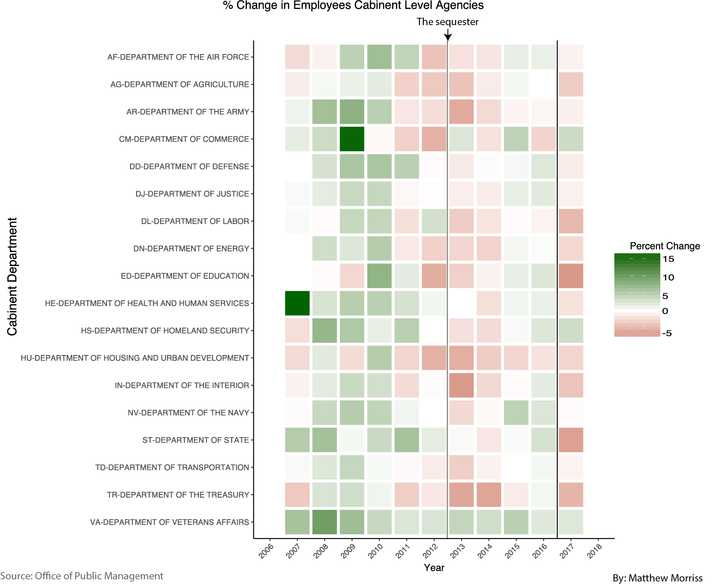

# Trump Administration Departures

In the early days of the Trump Administration, I became curious about how the executive branch was changing through time. This was driven by numerous accounts of how many employees were leaving Federal service through either resignations or early retirements.

I pulled the data down separately from the Office of Personnel Management and then began working on how to display this data. I found at heatmap particularly captivating as a means to display the data from each cabinet level agency.

These data clearly highlight that there was a significant decrease in the number of Employees in all Cabinet level federal agencies after the Trump administration took office.

For more details and plots see my multiple blog posts.

[Blog 1](https://matthewmorriss.weebly.com/codeblog/trump-administration-departures)

[Blog 2](https://matthewmorriss.weebly.com/codeblog/fluctuations-in-cabinet-level-agencies)
